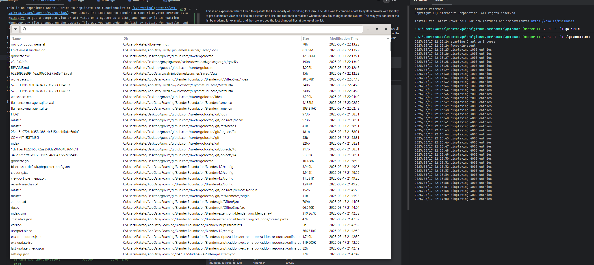

This is an experiment where I tried to replicate the functionality of [Everything](https://www.voidtools.com/support/everything/) for Linux. The idea was to combine a fast filesystem crawler with fsinotify to get a complete view of all files on a system as a list, and reorder it in realtime whenever any file changes on the system. This way you can order the list by modtime for example, and then always see the last changed files at the top of the list.

The program implements a simple UI in gtk3 with a filter line at the top where you can enter a regex to filter files with, and a list of files that displays all files matching the filter, which can be sorted by name, directory, size or modtime. The crawler spawns goroutines working through subdirectories of the users homedir, sorting the files on the fly and merging the results of all goroutines. The list on the UI receives updates about this in periodic intervals and updates the list of files. There is some logic to only show the first 1000 or so entries, and then increase the amount if the user scrolls down.

You can be build this on windows as well, I had to install gtk3 like so in the msys2 mingw 64-bit shell:
```
pacman -S mingw-w64-x86_64-gtk3
```

Then just you should be able to just call `go build` in the cloned repository inside msys2 mingw64.



---

    ~/g/s/golocate:master> go test -coverprofile=coverage.out -tags gtk_3_18 -bench ".*"
    2018/03/28 01:52:18 running TestBuckets
    2018/03/28 01:52:18 starting Crawl on 8 cores
    2018/03/28 01:52:23 Crawl terminated
    2018/03/28 01:52:26 len(byname): 860
    2018/03/28 01:52:26 len(bymodtime): 860
    2018/03/28 01:52:26 len(bysize): 860
    2018/03/28 01:52:26 TestBuckets finished
    2018/03/28 01:52:26 TestLess finished
    2018/03/28 01:52:26 running TestFileEntries
    2018/03/28 01:52:26 starting Crawl on 8 cores
    2018/03/28 01:52:31 Crawl terminated
    2018/03/28 01:52:35 len(byname): 860
    2018/03/28 01:52:35 len(bymodtime): 860
    2018/03/28 01:52:35 len(bysize): 860
    2018/03/28 01:52:35 TestFileEntries finished
    2018/03/28 01:52:35 TestSort finished
    2018/03/28 01:52:35 TestSortMerge finished
    goos: linux
    goarch: amd64
    pkg: golocate
    BenchmarkCrawlLargeSlice-8               100      16159321 ns/op
    BenchmarkCrawlBuckets-8                  200       8765915 ns/op
    BenchmarkSortedByName-8              3000000           459 ns/op
    BenchmarkSortedByModTime-8           3000000           560 ns/op
    BenchmarkSortedBySize-8              5000000           256 ns/op
    BenchmarkSortMergeByName-8           1000000          2093 ns/op
    BenchmarkSortMergeByModTime-8        2000000           810 ns/op
    BenchmarkSortMergeBySize-8            500000          2374 ns/op
    PASS
    coverage: 60.1% of statements
    ok      golocate    33.152s

    ~/g/s/golocate:master> go tool cover -func=coverage.out
    golocate/buckets.go:19:		Less			100.0%
    golocate/buckets.go:23:		String			0.0%
    golocate/buckets.go:27:		Less			100.0%
    golocate/buckets.go:31:		String			0.0%
    golocate/buckets.go:35:		Less			100.0%
    golocate/buckets.go:39:		String			0.0%
    golocate/buckets.go:70:		NewNameBucket		100.0%
    golocate/buckets.go:82:		NewModTimeBucket	100.0%
    golocate/buckets.go:126:	NewSizeBucket		100.0%
    golocate/buckets.go:148:	Merge			100.0%
    golocate/buckets.go:152:	Take			89.5%
    golocate/buckets.go:184:	NumFiles		0.0%
    golocate/buckets.go:194:	Less			100.0%
    golocate/buckets.go:209:	Sort			88.9%
    golocate/buckets.go:228:	AddBranch		100.0%
    golocate/buckets.go:237:	ThresholdSplit		85.7%
    golocate/buckets.go:254:	Node			100.0%
    golocate/buckets.go:258:	WalkEntries		88.9%
    golocate/buckets.go:289:	WalkNodes		80.0%
    golocate/buckets.go:316:	Print			0.0%
    golocate/buckets.go:338:	Insert			100.0%
    golocate/buckets.go:365:	Split			84.6%
    golocate/crawl.go:56:		Merge			100.0%
    golocate/crawl.go:60:		Take			90.9%
    golocate/crawl.go:99:		NumFiles		0.0%
    golocate/crawl.go:101:		visit			96.0%
    golocate/crawl.go:151:		Crawl			100.0%
    golocate/golocate.go:22:	createColumn		0.0%
    golocate/golocate.go:42:	setupTreeView		0.0%
    golocate/golocate.go:64:	setupSearchBar		0.0%
    golocate/golocate.go:73:	setupWindow		0.0%
    golocate/golocate.go:128:	addEntry		0.0%
    golocate/golocate.go:147:	updateEntry		0.0%
    golocate/golocate.go:163:	updateView		0.0%
    golocate/golocate.go:211:	main			0.0%
    golocate/sort.go:15:		Len			100.0%
    golocate/sort.go:16:		Swap			100.0%
    golocate/sort.go:17:		Less			100.0%
    golocate/sort.go:23:		Len			100.0%
    golocate/sort.go:24:		Swap			100.0%
    golocate/sort.go:25:		Less			100.0%
    golocate/sort.go:31:		Len			100.0%
    golocate/sort.go:32:		Swap			100.0%
    golocate/sort.go:33:		Less			100.0%
    golocate/sort.go:37:		sortFileEntries		100.0%
    golocate/sort.go:42:		sortMerge		95.7%
    total:				(statements)		60.1%
    ~/g/s/golocate:master>
